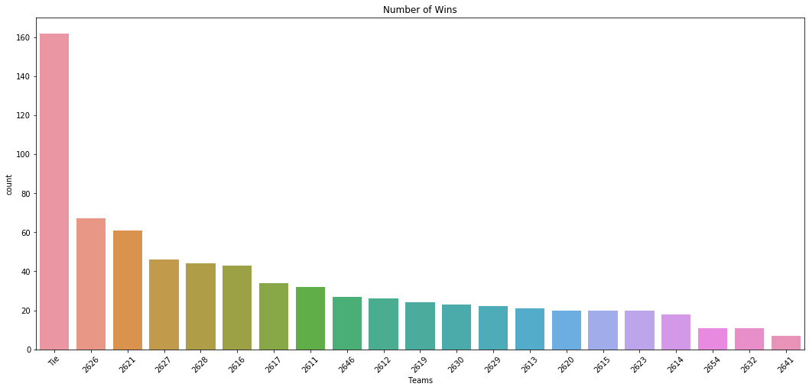
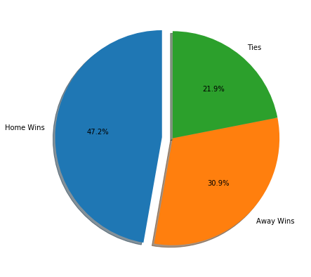
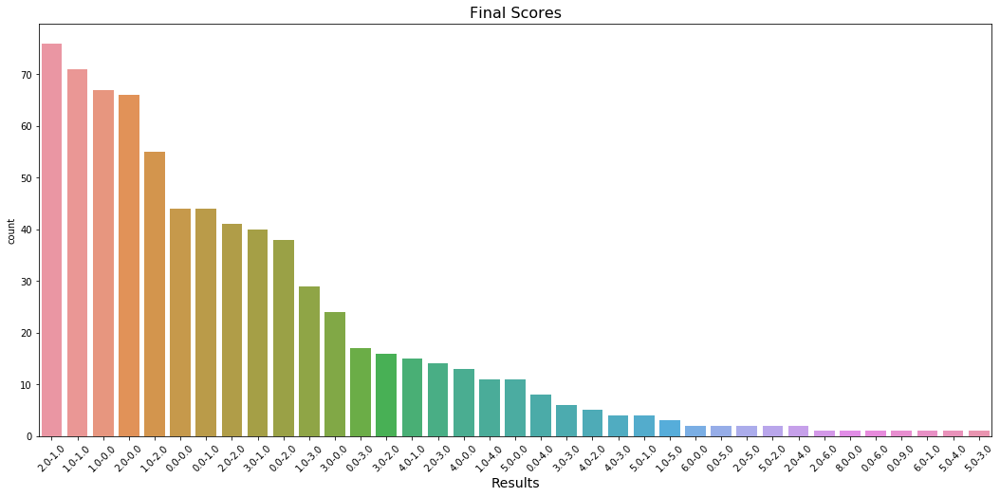
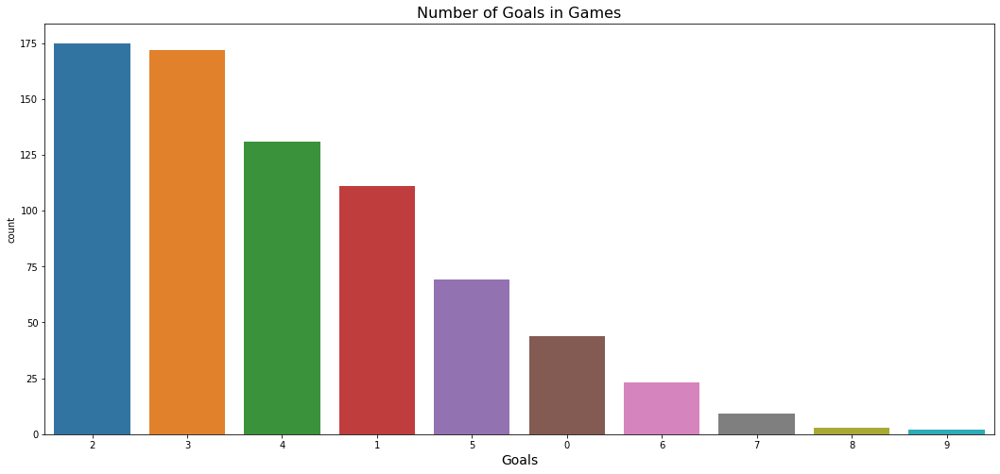

## IE 582 Fall 2019 - Group ID: 10 - Project Report
    
**Members:**
    Günay Eser
    
### Introduction


```python
from IPython.display import HTML
```


In this project, we are going to estimate the results(i.e. Home Win / Tie / Away Win) of the matches from English Premiere League using a machine learning method called Logistic Regression. The aim of this project is to see if it possible to predict football games' results better than bookmakers.

   It is a discouraging fact that game's results depends on so many parameters, like each team's players' strength, performances on last couple of matches, total kilometers run by players, passing accuracy, shot accuracy, ball possesion percentage for some of the teams, average number of accurate shots, goals scored and conceded in home and away games etc.
The data we have do not have many of the parameters that could be influential ready to be used as a dataset. So we will need to do **feature engineering** and derive some new feature columns from the data we already have. Then we will create our model and use Logistic Regression algorithm to predict probabilities of match results.


Now let's take a look at the data we have.

### Our Dataset

Our dataset contains 5 comma separated values files named **matches.csv , booking.csv , goals.csv , stats.csv , bets.csv** that are updated every 4 hours. Each team and match has unique ID and referred with that ID in each csv file.

**macthes.csv** file have information about matches played so far, that information we are going to use in this dataset is number of the goals scored by each team, each teams ID, matches ID and the league ID. We will extract only the macthes from English Premier League when working from the league ID. These are the all columns of matches.csv file:  **['match_awayteam_id',
 'match_hometeam_id',
 'match_id',
 'epoch',
 'match_status',
 'match_live',
 'match_hometeam_name',
 'match_awayteam_name',
 'match_hometeam_score',
 'match_awayteam_score',
 'match_hometeam_halftime_score',
 'match_awayteam_halftime_score',
 'match_hometeam_extra_score',
 'match_awayteam_extra_score',
 'match_hometeam_penalty_score',
 'match_awayteam_penalty_score',
 'league_id']** 
 
 First 8 columns and 5 rows of the matches.csv dataset is below:


```python
import pandas as pd
pd.read_csv("matches.csv").head().iloc[:,:8]
```


<div>
<style scoped>
    .dataframe tbody tr th:only-of-type {
        vertical-align: middle;
    }

    .dataframe tbody tr th {
        vertical-align: top;
    }

    .dataframe thead th {
        text-align: right;
    }
</style>
<table border="1" class="dataframe">
  <thead>
    <tr style="text-align: right;">
      <th></th>
      <th>match_awayteam_id</th>
      <th>match_hometeam_id</th>
      <th>match_id</th>
      <th>epoch</th>
      <th>match_status</th>
      <th>match_live</th>
      <th>match_hometeam_name</th>
      <th>match_awayteam_name</th>
    </tr>
  </thead>
  <tbody>
    <tr>
      <th>0</th>
      <td>7109</td>
      <td>7097</td>
      <td>41196</td>
      <td>1505559600</td>
      <td>Finished</td>
      <td>0</td>
      <td>Levante</td>
      <td>Valencia</td>
    </tr>
    <tr>
      <th>1</th>
      <td>2614</td>
      <td>2619</td>
      <td>13331</td>
      <td>1505561400</td>
      <td>Finished</td>
      <td>0</td>
      <td>Crystal Palace</td>
      <td>Southampton</td>
    </tr>
    <tr>
      <th>2</th>
      <td>3224</td>
      <td>3238</td>
      <td>17683</td>
      <td>1505568600</td>
      <td>Finished</td>
      <td>0</td>
      <td>Eintracht Frankfurt</td>
      <td>FC Augsburg</td>
    </tr>
    <tr>
      <th>3</th>
      <td>3235</td>
      <td>3223</td>
      <td>17684</td>
      <td>1505568600</td>
      <td>Finished</td>
      <td>0</td>
      <td>SV Werder Bremen</td>
      <td>Schalke</td>
    </tr>
    <tr>
      <th>4</th>
      <td>3237</td>
      <td>3225</td>
      <td>17682</td>
      <td>1505568600</td>
      <td>Finished</td>
      <td>0</td>
      <td>Bayern Munich</td>
      <td>1. FSV Mainz 05</td>
    </tr>
  </tbody>
</table>
</div>


**stats.csv** contains some numerical information inside matches like offsides, shots on goal, fouls, corner kicks etc. Columns in this dataset: 

**['match_id',
 'home_BallPossession',
 'home_CornerKicks',
 'home_Fouls',
 'home_GoalAttempts',
 'home_GoalkeeperSaves',
 'home_Offsides',
 'home_ShotsoffGoal',
 'home_ShotsonGoal',
 'home_YellowCards',
 'away_BallPossession',
 'away_CornerKicks',
 'away_Fouls',
 'away_GoalAttempts',
 'away_GoalkeeperSaves',
 'away_Offsides',
 'away_ShotsoffGoal',
 'away_ShotsonGoal',
 'away_YellowCards',
 'home_BlockedShots',
 'away_BlockedShots',
 'home_FreeKicks',
 'away_FreeKicks',
 'home_Throw-in',
 'away_Throw-in',
 'home_RedCards',
 'away_RedCards',
 'home_Tackles',
 'home_TotalPasses',
 'away_Tackles',
 'away_TotalPasses',
 'home_CompletedPasses',
 'away_CompletedPasses',
 'home_GoalKicks',
 'away_GoalKicks',
 'home_DistanceCovered(metres)',
 'away_DistanceCovered(metres)',
 'home_PassSuccess%',
 'away_PassSuccess%',
 'home_Attacks',
 'home_DangerousAttacks',
 'away_Attacks',
 'away_DangerousAttacks',
 'home_',
 'away_']**
 
 First 8 columns and 5 rows of the matches.csv dataset is below:


```python
pd.read_csv('stats.csv').head().iloc[:,:8]
```


<div>
<style scoped>
    .dataframe tbody tr th:only-of-type {
        vertical-align: middle;
    }

    .dataframe tbody tr th {
        vertical-align: top;
    }

    .dataframe thead th {
        text-align: right;
    }
</style>
<table border="1" class="dataframe">
  <thead>
    <tr style="text-align: right;">
      <th></th>
      <th>match_id</th>
      <th>home_BallPossession</th>
      <th>home_CornerKicks</th>
      <th>home_Fouls</th>
      <th>home_GoalAttempts</th>
      <th>home_GoalkeeperSaves</th>
      <th>home_Offsides</th>
      <th>home_ShotsoffGoal</th>
    </tr>
  </thead>
  <tbody>
    <tr>
      <th>0</th>
      <td>13327</td>
      <td>71%</td>
      <td>12.0</td>
      <td>7.0</td>
      <td>35.0</td>
      <td>3.0</td>
      <td>1.0</td>
      <td>14.0</td>
    </tr>
    <tr>
      <th>1</th>
      <td>13329</td>
      <td>33%</td>
      <td>3.0</td>
      <td>8.0</td>
      <td>7.0</td>
      <td>4.0</td>
      <td>2.0</td>
      <td>5.0</td>
    </tr>
    <tr>
      <th>2</th>
      <td>13331</td>
      <td>45%</td>
      <td>5.0</td>
      <td>14.0</td>
      <td>14.0</td>
      <td>3.0</td>
      <td>0.0</td>
      <td>9.0</td>
    </tr>
    <tr>
      <th>3</th>
      <td>13446</td>
      <td>51%</td>
      <td>7.0</td>
      <td>7.0</td>
      <td>6.0</td>
      <td>3.0</td>
      <td>0.0</td>
      <td>4.0</td>
    </tr>
    <tr>
      <th>4</th>
      <td>13447</td>
      <td>49%</td>
      <td>3.0</td>
      <td>18.0</td>
      <td>20.0</td>
      <td>1.0</td>
      <td>1.0</td>
      <td>8.0</td>
    </tr>
  </tbody>
</table>
</div>


**bets.csv** file contains odd informations for matches from different bookmakers:

We will use **home_win , tie , away win** odds while creating our model. Note that, 
the value **odd_***: Odd is related to game result where * being equal to 1 represent the odds for home
team, x stands for draw (tie) odds and 2 is for the away team.

Here how bets.csv dataframe looks like:


```python
pd.read_csv('bets.csv').head()
```


<div>
<style scoped>
    .dataframe tbody tr th:only-of-type {
        vertical-align: middle;
    }

    .dataframe tbody tr th {
        vertical-align: top;
    }

    .dataframe thead th {
        text-align: right;
    }
</style>
<table border="1" class="dataframe">
  <thead>
    <tr style="text-align: right;">
      <th></th>
      <th>match_id</th>
      <th>odd_bookmakers</th>
      <th>odd_epoch</th>
      <th>variable</th>
      <th>value</th>
    </tr>
  </thead>
  <tbody>
    <tr>
      <th>0</th>
      <td>146845</td>
      <td>BetOlimp</td>
      <td>1486301854</td>
      <td>odd_1</td>
      <td>1.96</td>
    </tr>
    <tr>
      <th>1</th>
      <td>151780</td>
      <td>10Bet</td>
      <td>1486314920</td>
      <td>odd_1</td>
      <td>2.15</td>
    </tr>
    <tr>
      <th>2</th>
      <td>151780</td>
      <td>18bet</td>
      <td>1486314920</td>
      <td>odd_1</td>
      <td>2.17</td>
    </tr>
    <tr>
      <th>3</th>
      <td>151780</td>
      <td>1xBet</td>
      <td>1486314920</td>
      <td>odd_1</td>
      <td>2.20</td>
    </tr>
    <tr>
      <th>4</th>
      <td>151780</td>
      <td>5Dimes</td>
      <td>1486314920</td>
      <td>odd_1</td>
      <td>2.23</td>
    </tr>
  </tbody>
</table>
</div>


**goals.csv** file has information about goal time, scorer, new result. I did not prefer to use any data from this dataset. So, I simply show a glimpse of it and continue.


```python
pd.read_csv('goals.csv').head()
```


<div>
<style scoped>
    .dataframe tbody tr th:only-of-type {
        vertical-align: middle;
    }

    .dataframe tbody tr th {
        vertical-align: top;
    }

    .dataframe thead th {
        text-align: right;
    }
</style>
<table border="1" class="dataframe">
  <thead>
    <tr style="text-align: right;">
      <th></th>
      <th>match_id</th>
      <th>time</th>
      <th>home_scorer</th>
      <th>score</th>
      <th>away_scorer</th>
    </tr>
  </thead>
  <tbody>
    <tr>
      <th>0</th>
      <td>13327</td>
      <td>30</td>
      <td>Salah M.</td>
      <td>1 - 1</td>
      <td>NaN</td>
    </tr>
    <tr>
      <th>1</th>
      <td>13446</td>
      <td>35</td>
      <td>Colin M.</td>
      <td>1 - 0</td>
      <td>NaN</td>
    </tr>
    <tr>
      <th>2</th>
      <td>13446</td>
      <td>56</td>
      <td>NaN</td>
      <td>1 - 1</td>
      <td>Johnson D.</td>
    </tr>
    <tr>
      <th>3</th>
      <td>13446</td>
      <td>60</td>
      <td>NaN</td>
      <td>1 - 2</td>
      <td>Hugill J.</td>
    </tr>
    <tr>
      <th>4</th>
      <td>13446</td>
      <td>67</td>
      <td>NaN</td>
      <td>1 - 3</td>
      <td>Barkhuizen T.</td>
    </tr>
  </tbody>
</table>
</div>


**booking.csv** file contains information about bookings in games. Name of the player, time and colour of the card. I did not use this dataset while creating my model again. 

Here is how it looks like:


```python
pd.read_csv("booking.csv").head()
```


<div>
<style scoped>
    .dataframe tbody tr th:only-of-type {
        vertical-align: middle;
    }

    .dataframe tbody tr th {
        vertical-align: top;
    }

    .dataframe thead th {
        text-align: right;
    }
</style>
<table border="1" class="dataframe">
  <thead>
    <tr style="text-align: right;">
      <th></th>
      <th>match_id</th>
      <th>time</th>
      <th>home_fault</th>
      <th>card</th>
      <th>away_fault</th>
    </tr>
  </thead>
  <tbody>
    <tr>
      <th>0</th>
      <td>13327</td>
      <td>90+3</td>
      <td>Can E.</td>
      <td>yellow card</td>
      <td>NaN</td>
    </tr>
    <tr>
      <th>1</th>
      <td>13329</td>
      <td>29</td>
      <td>Holebas J.</td>
      <td>yellow card</td>
      <td>NaN</td>
    </tr>
    <tr>
      <th>2</th>
      <td>13329</td>
      <td>40</td>
      <td>Doucoure A.</td>
      <td>yellow card</td>
      <td>NaN</td>
    </tr>
    <tr>
      <th>3</th>
      <td>13331</td>
      <td>33</td>
      <td>Cabaye Y.</td>
      <td>yellow card</td>
      <td>NaN</td>
    </tr>
    <tr>
      <th>4</th>
      <td>13331</td>
      <td>50</td>
      <td>Puncheon J.</td>
      <td>yellow card</td>
      <td>NaN</td>
    </tr>
  </tbody>
</table>
</div>


**Lets see which teams has the most wins in this dataset:**


```python
matches = pd.read_csv('matches.csv')
matches = matches.drop(['epoch', 'match_status', 'match_live', 'match_hometeam_penalty_score' , 
                    'match_awayteam_penalty_score',  'match_hometeam_extra_score', 'match_awayteam_extra_score'], axis=1)
matches.columns = ['away_id', 'home_id', 'match_id', 'home_name', 'away_name' ,  'home_score', 
                   'away_score', 'home_half_score', 'away_half_score', 'league_id']
matches.fillna('', inplace = True) 
matches_gb = matches[matches['league_id'] == 148].copy()
matches_gb = matches_gb.reset_index(drop=True)
cut = matches_gb[matches_gb['home_score'] == ''].index[0]
matches_gb = matches_gb.iloc[:cut,:]
winners = list()
homes = matches_gb.iloc[:,5:6].values.tolist()
aways = matches_gb.iloc[:,6:7].values.tolist()
away_teams = matches_gb.iloc[:,0:1].values.tolist()
home_teams = matches_gb.iloc[:,1:2].values.tolist()
for i in range(len(homes)):
    if homes[i][0] > aways[i][0]:
        winners.append(str(home_teams[i][0]))
        
    elif homes[i][0] == aways[i][0]:
        winners.append("Tie")
        
    elif homes[i][0] < aways[i][0]:
        winners.append(winners.append(str(away_teams[i][0])))
for i in winners:
    if i == None:
        winners.remove(i)
matches_gb['winners'] = winners
matches_gb.head()
import seaborn as sns
import matplotlib.pyplot as plt
plt.figure(figsize = (18,8))
plt.title("Number of Wins")
ax = sns.countplot(x='winners', data=matches_gb,  order = matches_gb['winners'].value_counts().index)
ax.set_xticklabels(ax.get_xticklabels(), rotation=45)
plt.xlabel('Teams')
plt.show()
```





As we can see the team 2626 and 2621 has slightly more number of wins and the team 2641 has the smallest number of wins. Let's see which teams' IDs are these:


```python
d = pd.read_csv("matches.csv")
first = d[d['match_hometeam_id'] == 2626 ]['match_hometeam_name'].tolist()[0]
second = d[d['match_hometeam_id'] == 2621 ]['match_hometeam_name'].tolist()[0]
last = d[d['match_hometeam_id'] == 2641 ]['match_hometeam_name'].tolist()[0]
print('1st : ',first ,'\n2nd : ', second , '\nLast : ' , last )
```

    1st :  Manchester City 
    2nd :  Liverpool 
    Last :  Norwich
    

**Let's see the proportions of wins in the aspect of Home Games and Away Games:**


```python
teams = matches_gb['home_id'].tolist()
winners =  matches_gb['winners'].tolist()
home_win_count = 0
for i in range(len(teams)):
    if str(teams[i]) == winners[i]:
        home_win_count +=1
home_win_count
teams = matches_gb['away_id'].tolist()
away_win_count = 0
for i in range(len(teams)):
    if str(teams[i]) == winners[i]:
        away_win_count +=1
print('Total Number of Games: ' , len(teams), "\nNumber of Home Team Wins: " , home_win_count, '\nNumber of Away Team Wins: ', away_win_count ,
      '\nNumber of Ties: ' , len(teams) - (away_win_count + home_win_count))
import matplotlib.pyplot as plt
labels = ['Home Wins', 'Away Wins', 'Ties']
sizes = [home_win_count, away_win_count, len(teams) - (away_win_count + home_win_count)]
colors = ['green', 'gold', 'gray']
explode = (0.1, 0, 0)  
plt.figure(figsize = (7,7))
ax1 = plt.pie(sizes, explode=explode, labels=labels, autopct='%1.1f%%',
        shadow=True, startangle=90)
plt.show()
```

    Total Number of Games:  739 
    Number of Home Team Wins:  349 
    Number of Away Team Wins:  228 
    Number of Ties:  162
    





As we can see %47.2 of all matches are won by home teams. %30.9 are won by away teams, %21.9 are finished in tie.

**Let's see what score results are more likely to happen:**


```python
matches_gb.head()
home_scores = matches_gb.home_score.tolist()
away_scores = matches_gb.away_score.tolist()
final_score = list()
for i in range(len(home_scores)):
    final_score.append(str(home_scores[i]) +'-' + str(away_scores[i]))
matches_gb['final_score'] = final_score
import seaborn as sns
import matplotlib.pyplot as plt
plt.figure(figsize = (18,8))
plt.title("Final Scores", fontsize = 16)
ax = sns.countplot(x=final_score, data=matches_gb,  order = matches_gb['final_score'].value_counts().index)
ax.set_xticklabels(ax.get_xticklabels(), rotation=45)
plt.xlabel('Results', fontsize = 14)
plt.show()
```





As we can see here,

2-1

1-1

1-0

2-0

1-2

0-0

0-1

are the most common final results of matches.

**Now let's see how total number of goals in matches occured:**


```python
total_goals = list()
for i in range(len(home_scores)):
    total_goals.append(int(home_scores[i]) + int(away_scores[i]))
matches_gb['total_goals'] = total_goals
plt.figure(figsize = (18,8))
plt.title("Number of Goals in Games", fontsize = 16)
ax = sns.countplot(x=total_goals, data=matches_gb,  order = matches_gb['total_goals'].value_counts().index)
ax.set_xticklabels(ax.get_xticklabels())
plt.xlabel('Goals', fontsize=14)
plt.show()
```





It is more likely to see 2 or 3 goals in a match played in English Premiere League.

**Let's check the highest correlations that home score and away score have with columns in stats.csv:** 


```python
matches_gb['home_score'] = matches_gb.iloc[:,5:6].astype(float)
matches_gb['away_score'] = matches_gb.iloc[:,6:7].astype(float)
all_ = pd.merge(matches_gb, stats, on='match_id')
corr_matrix = all_.corr(method='pearson')
```

Top 10 highest correlation with home_score:


```python
corr_matrix[['home_score']].sort_values(by='home_score', ascending=False).head(10)
```


<div>
<style scoped>
    .dataframe tbody tr th:only-of-type {
        vertical-align: middle;
    }

    .dataframe tbody tr th {
        vertical-align: top;
    }

    .dataframe thead th {
        text-align: right;
    }
</style>
<table border="1" class="dataframe">
  <thead>
    <tr style="text-align: right;">
      <th></th>
      <th>home_score</th>
    </tr>
  </thead>
  <tbody>
    <tr>
      <th>home_score</th>
      <td>1.000000</td>
    </tr>
    <tr>
      <th>total_goals</th>
      <td>0.672550</td>
    </tr>
    <tr>
      <th>home_ShotsonGoal</th>
      <td>0.580459</td>
    </tr>
    <tr>
      <th>home_GoalAttempts</th>
      <td>0.301712</td>
    </tr>
    <tr>
      <th>home_TotalPasses</th>
      <td>0.239267</td>
    </tr>
    <tr>
      <th>home_CompletedPasses</th>
      <td>0.233299</td>
    </tr>
    <tr>
      <th>away_RedCards</th>
      <td>0.147557</td>
    </tr>
    <tr>
      <th>away_GoalkeeperSaves</th>
      <td>0.109195</td>
    </tr>
    <tr>
      <th>home_Attacks</th>
      <td>0.092944</td>
    </tr>
    <tr>
      <th>home_DangerousAttacks</th>
      <td>0.073539</td>
    </tr>
  </tbody>
</table>
</div>


Top 10 highest correlation with away_score:


```python
corr_matrix[['away_score']].sort_values(by='away_score', ascending=False).head(10)
```


<div>
<style scoped>
    .dataframe tbody tr th:only-of-type {
        vertical-align: middle;
    }

    .dataframe tbody tr th {
        vertical-align: top;
    }

    .dataframe thead th {
        text-align: right;
    }
</style>
<table border="1" class="dataframe">
  <thead>
    <tr style="text-align: right;">
      <th></th>
      <th>away_score</th>
    </tr>
  </thead>
  <tbody>
    <tr>
      <th>away_score</th>
      <td>1.000000</td>
    </tr>
    <tr>
      <th>total_goals</th>
      <td>0.625856</td>
    </tr>
    <tr>
      <th>away_ShotsonGoal</th>
      <td>0.613365</td>
    </tr>
    <tr>
      <th>away_Throw-in</th>
      <td>0.397996</td>
    </tr>
    <tr>
      <th>away_GoalAttempts</th>
      <td>0.372226</td>
    </tr>
    <tr>
      <th>home_RedCards</th>
      <td>0.343701</td>
    </tr>
    <tr>
      <th>home_Throw-in</th>
      <td>0.297918</td>
    </tr>
    <tr>
      <th>away_CompletedPasses</th>
      <td>0.185685</td>
    </tr>
    <tr>
      <th>away_TotalPasses</th>
      <td>0.166019</td>
    </tr>
    <tr>
      <th>home_GoalkeeperSaves</th>
      <td>0.146734</td>
    </tr>
  </tbody>
</table>
</div>


### Related Literature

In 2006 Babak Hamadani tried to predict outcomes of NFL games at Stanford University. He approached with SVM and logistic regression and ended up with the idea that logistic regression is the best algorithm for his purpose. Here is the link for his work:

http://cs229.stanford.edu/proj2006/BabakHamadani-PredictingNFLGames.pdf

In 2009 Jack David Blundell also tried to predict outcomes of American Football games. He used some features like win ratio of 2 years, Stadium Capacity, result of the last year's corresponding game between the two teams. He also used logistic regression algorithm and reached %65 accuracy. Here is the link for his work:

https://docplayer.net/7250749-Numerical-algorithms-for-predicting-sports-results.html

### Approach

1. Discard the features that I am not going to use for certain.


2. Deciding the features I might use to derive new features.


3. Extracting required data from the CSV's.


4. Creating model, shaping it for Logistic Regression.


5. Applying logistic regression to train model with 10 Fold Cross Validation to find best parameters.


6. Predict upcoming games using best parameters.


**Here are the explanation of my steps:**

   - First of all, I needed to create proper Pandas dataframes since I used Python in this project. So I prepared all the data into playable right formatted dataframes. I dropped data with empty values which is the cheapest way in terms of saving time.
   
   
   - Most of the work I have done was shaping and transforming the data on the macthes.csv file.


   - I One-Hot Encoded team IDs from the data which contains the match results, in order to teach algorithm the teams.
   
   
   - Since the data also have the upcoming matches which has no score values sinc eit has not been played, I cut it off from original data.
   
   
   - The data did not have a result columns that indicates "Winner ID" or "Tie" if there is no winner. So I created a column to indicate that.
   
   
   - Since our data did not have the strenght of the players from the teams. I needed our algorithm to know which team is better than others. So I wrote a function to calculate a scoring scale for the teams in Premier League:
   
   
   - That scoring system is based on the number of wins. And that scoring scale will be between 1 to 10. In other words, the most powerfull team let's say Manchester City with the most win number would have the score of 10 out of ten, while the other would decay to 1 by their number of wins.
   
   
   - From the stats.csv file, I decided to use only the data about, 
   
       1. Shot Accuracy
       2. Ball Possesion
       3. Total Passes
       
       
   - From the bets.csv file, I only extracted the data about match result odds. Since there were many bookmakers in the data, I calculated the mean odd from all the odds for a match's result that were determined by many bookmakers. 
   
   For example, if odd_1 for a match is from 3 different bookmakers given like:
           2,46
           2,44
           2,42
       I took the mean of them which is 2,44.
       
       
   - Next, I wrote a long function that creates most of the features that will be used in learning process. When I create these fetures I decided that the last 6 matches of the concerned team would be more accurate in order to evaluate them before the next match.
   
   
   Those are: 
       
   Total Win Rate (For last 6 games),
   
   Home Win Rate (For last 6 games), 
   
   Away Win Rate (For last 6 games), 
   
   Home Goals (For last 6 games), 
   
   Away Goals (For last 6 games), 
   
   Score Points(1 - 10), 
   
   Goals Conceded (For last 6 games), 
   
   Mean Goals Conceded (For last 6 games), 
   
   Stdev of Goals (For last 6 games), 
   
   Home Mean Possession (For last 6 games), 
   
   Away Mean Possession (For last 6 games), 
   
   Mean Home Shots On Target (For last 6 games), 
   
   Mean Away Shots On Target (For last 6 games), 
   
   Shot Accuracy Rate (For last 6 games)
   
   and these values are calculated for both home team and away team to be faced each other.
   
   
   - Next, I turned winner column into ordinal numerical column which is also our target column:
   
   
       1 for home
       2 for tie
       3 for away win
       
       
   - Then I merged all the usefull feature into one dataframe and I get my final dataframe with 75 columns with all the odds, teams stats, one hot encodings.
   
   
   - Next using 0.85 of all the data I did a parameter tuning for logistic regression using 10 fold Cross Validation to find best parameters. Then I predicted other 0.15 as my test data. I did this process 10 times.
   
   - I also wrote a fucntion to calculate my RPS score. The smallest RPS score I have seen was 0.10.
   
   
   - Then I predcited upcoming matches using the best model I found out.
   
   

### Results

Here are the results of my 10 times of application of 10 Fold Cross Validaiton to tune parameters. Each run from that 10 times, I used %85 as train and %15 as test data.

- Best Penalty: l2
- Best C: 0.01
- Accuracy :  0.6206896551724138
- RPS Score:  0.17158063230042597


- Best Penalty: l1
- Best C: 0.1
- Accuracy :  0.603448275862069
- RPS Score:  0.15089869065597575


- Best Penalty: l2
- Best C: 100
- Accuracy :  0.7241379310344828
- RPS Score:  0.10971506468930081


- Best Penalty: l1
- Best C: 0.1
- Accuracy :  0.6206896551724138
- RPS Score:  0.18230525225950397


- Best Penalty: l1
- Best C: 1
- Accuracy :  0.6551724137931034
- RPS Score:  0.15197681544762726


- Best Penalty: l1
- Best C: 0.1
- Accuracy :  0.7068965517241379
- RPS Score:  0.14542813907487892


- Best Penalty: l1
- Best C: 1
- Accuracy :  0.6206896551724138
- RPS Score:  0.13746278150739197


- Best Penalty: l2
- Best C: 0.01
- Accuracy :  0.6896551724137931
- RPS Score:  0.12983389880879134


- Best Penalty: l2
- Best C: 0.1
- Accuracy :  0.6724137931034483
- RPS Score:  0.15857497000911852


- Best Penalty: l2
- Best C: 1
- Accuracy :  0.6551724137931034
- RPS Score:  0.15837313613683457


The accuracy changes between %60 and %72, which I think is not that bad but not stable. Best parameters change every time and that makes it untrustable.


Mean of these RPS Scores : 0.14


I also need to say that model is not that good at when predicting matches ahead. 

### Summary and Future Work

Briefly, first of all, it was an enjoyable project to work on. I found out that it is very hard to predict match results using the data we have since there many options on **feature engineering** part and trying every one of them would take plenty of time. 

There are some "what if ?" questions in my mind about making this prediction more accurate.


   - What if I normalize all the data I have ? Would it help or not ? Since there are some certain data that needed to be on a different scale.
   
   
   - What if I used less feature than I did, would make logistic regression to work better or not ? Since I have like 75 independent variable.
   
   
   - What if I choose a different scoring system for the teams in order to teach algorithm how strong are the teams when compared one to another ? I only used total number of wins so far and scaled the points between 1 - 10.
   
   
Those are the questions that I could work on in the future and test.


There are also couple of possibble additions to this project with the data we have like:

   1. **Exact minutes of the goals.** It is obvious that in football, some teams are tend to concede more goals in different periods of the games they play. Like first 15 minutes or between 60th to 75th minutes. That could also help with the prediction in my opinion.
   
   
   2. **Bookings.** Although I havent used any data about bookings, It is possible that if the team had faced a red card in last 2 or 3 games, that could affect their game ahead (Depends on the player who got booked but we don't have player's strentgh data).
   
   
   3. **Air conditions** might also added to this dataset considering some teams could play better on some type of weathers. However, that data must be taken from somewhere else.
   
   
   4. **Stadium Capacity/Number of Spectators** could be usefull and added to the model like Jack David Blundell did in 2009.

### Codes

You can jump into my codes using the link below:

https://bu-ie-582.github.io/fall19-GnyEser/Project.html
